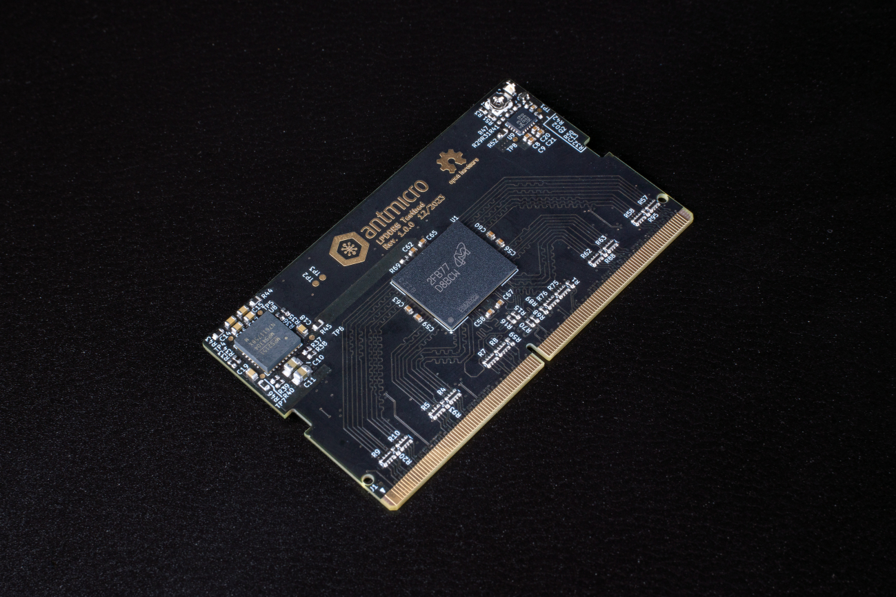

# LPDDR5 Testbed

Copyright (c) 2023 [Antmicro](https://www.antmicro.com)

## Overview

This project contains open hardware design files for an experimental test module in a mechanical form of SO-DIMM DDR5. 

The module includes a standard 315-ball WFBGA (12.4mm × 15.0mm × 0.8mm, Ø0.42 SMD) LPDDR5 RAM footprint break-routed in the SO-DIMM edge connector. 
The design files were prepared in KiCad. 

Please note that this board is not electrically compatible with off-the-shelf hot platforms accepting SO-DIMM DDR5 memory modules. 
It is compatible with [this](https://github.com/antmicro/sodimm-ddr5-tester) test platform.

## Project structure

The main project directory contains KiCad PCB project files, a LICENSE and README. 
The remaining files are stored in the following directories:

* `lib` - contains the component libraries
* `img` - contains graphics for this README
* `doc` - contains PDF schematic
* `assets` - contains visual assets for showcasing this board on Antmicro [Open Hardware Portal](https://openhardware.antmicro.com).

## Licensing

This project is published under the [Apache-2.0](LICENSE) license.
